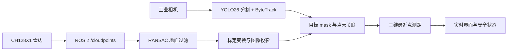
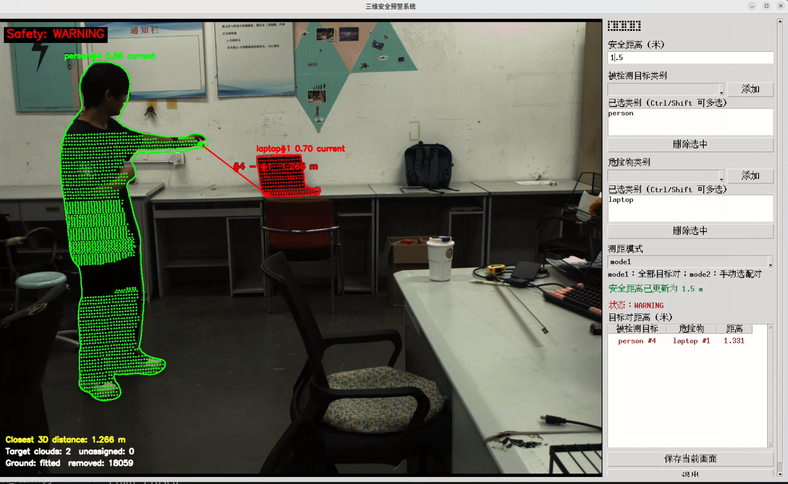
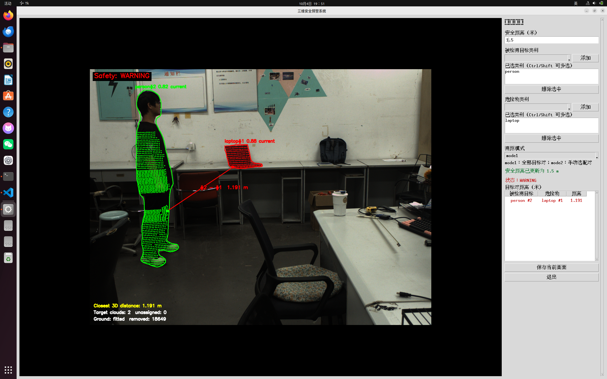
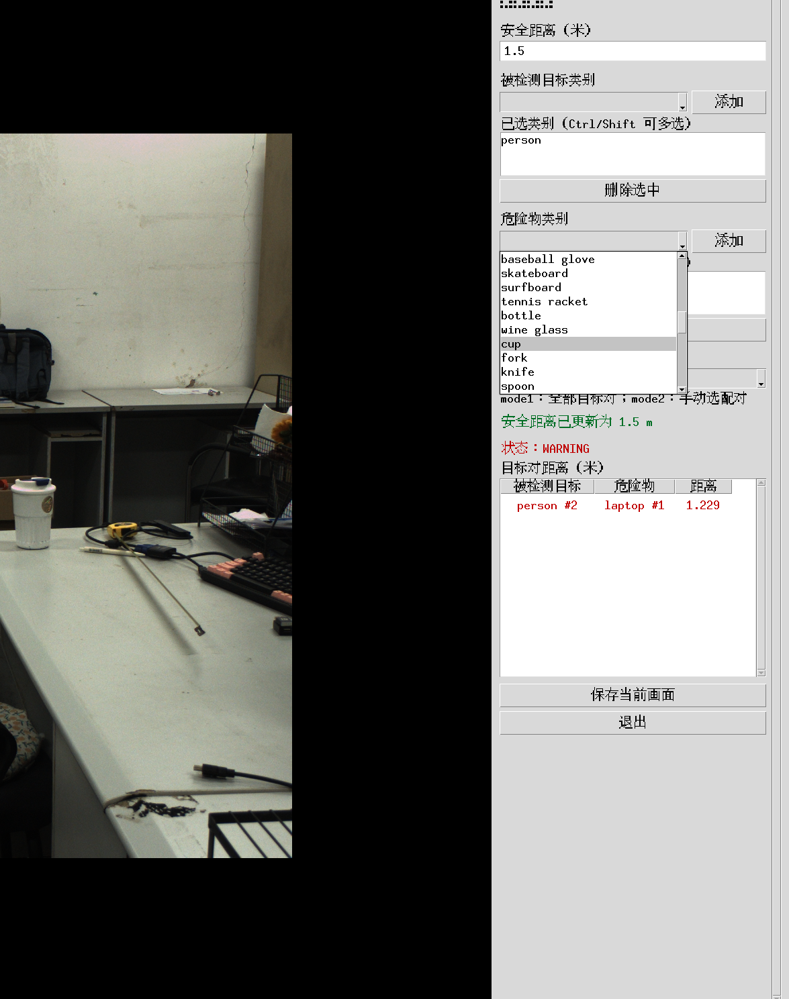
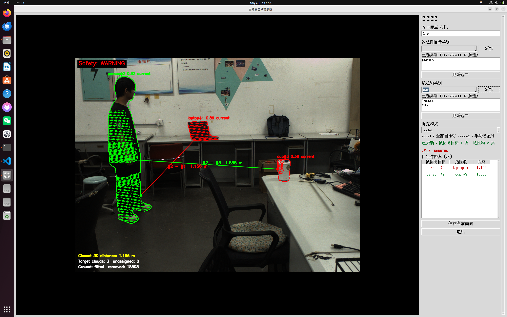
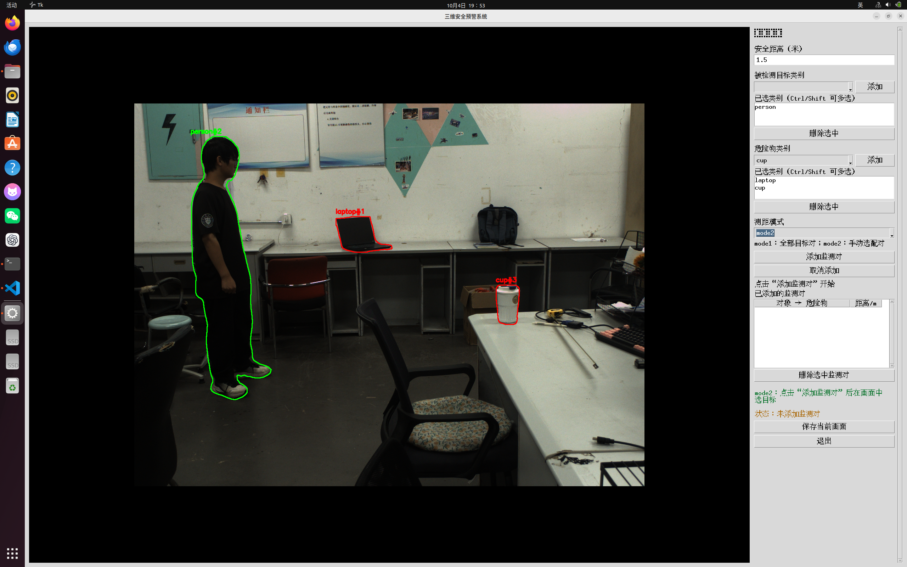
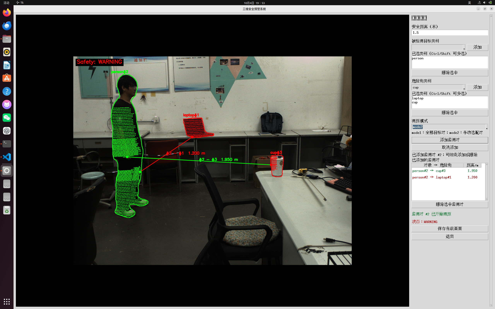

# 三维安全预警系统

基于工业相机与激光雷达的目标感知和三维距离预警原型。系统用 YOLO26 实例分割识别目标，通过 ByteTrack 维持目标 ID，将雷达点云投影到相机图像并关联到目标轮廓，最后计算**被监测目标与危险物可见点云之间的最近点距离**，而不是目标质心之间的距离。

当前示例使用 COCO 实例分割权重，默认将 `person` 设为被监测目标、`laptop` 设为危险物。界面支持从权重可识别的类别中实时增删两组目标；更换场景或自训练权重时，需要同步调整类别配置及现场标定。

> 本项目是感知算法原型。距离来自当前视角下可见的离散雷达点，遮挡、点云稀疏、误检、跟踪 ID 切换以及相机与雷达不同步都可能影响结果。请勿把当前输出作为唯一的现场安全防护依据。

### 实机演示视频： https://b23.tv/xogjBsu

## 功能

- **实例分割与跟踪**：YOLO26 分割模型输出目标 mask，ByteTrack 分配 ID；对低置信度轮廓进行确认、短时保留和显示平滑。暂存轮廓不参与点云测距。
- **点云接入与投影**：ROS 2 订阅 `/cloudpoints`，缓存最近三帧，融合时只使用最新且未过期的一帧；按相机内参、畸变参数和相机→雷达外参投影到原始相机图像。
- **地面过滤与目标点云关联**：Open3D RANSAC 估计地面平面；清理 mask 小岛、处理重叠轮廓，并用三维点团和目标历史位置筛选目标点云。
- **最近点测距与预警**：计算两团目标点云之间的最近点对。距离大于安全阈值显示 `SAFE` 和绿色连线；距离小于或等于阈值显示 `WARNING` 和红色连线；无法得到有效距离时显示 `UNKNOWN`。
- **两种显示模式**：`mode1` 显示所有被监测目标与危险物的组合；`mode2` 先只显示轮廓和 ID，由用户在画面中点击并建立指定监测对，可添加多对、删除监测对。



## 效果截图

## 本系统的测距特性：输出三维空间下目标间最近部位的距离




## `mode1`：显示被监测目标与危险物的点云、最近距离和安全状态。




## 添加下一个目标

<div style="display: flex; justify-content: center; gap: 12px;">
  
  
</div>


## `mode2`：未添加监测对时，只显示轮廓与 ID。




## 添加两组监测对后，界面只显示这两组的点云与距离。



## 运行环境

当前开发环境为 Ubuntu 22.04、Python 3.10、ROS 2 Humble。硬件使用海康工业相机（MVS SDK）和镭神 CH128X1 以太网雷达。Python 侧主要依赖 PyTorch、Ultralytics、OpenCV、Open3D、NumPy、Pillow、PyYAML 和 `ruamel.yaml`；ROS 2 侧使用 `rclpy`、`sensor_msgs` 和 `sensor_msgs_py`。

项目内的 `yolo26/` 是当前使用的 Ultralytics 源码，`ros2_ws/src/` 包含雷达驱动源码。海康 MVS SDK 需要按设备与系统安装；相机 Python 封装通过环境变量 `MVCAM_COMMON_RUNENV` 查找 SDK 的 `lib/64/libMvCameraControl.so`。

## 快速开始

以下命令从项目根目录执行。请先安装 ROS 2 Humble、海康 MVS SDK，并创建与 ROS 2 Humble 兼容的 Python 3.10 环境；PyTorch 请按本机 CPU/GPU 环境安装。

1. 安装 Python 依赖。若使用已有的 `torch` Conda 环境：

   ```bash
   conda activate torch
   python -m pip install -e ./yolo26
   python -m pip install open3d ruamel.yaml
   ```

2. 按现场设备修改配置：

   - `bin_cam_config.yaml`：相机序列号、原图分辨率、相机内参/畸变参数，以及**本机标定**的相机→雷达外参。当前程序在 `main.py` 中使用 `right` 相机。
   - `ros2_ws/src/lslidar_driver/config/lslidar_ch.yaml`：核对雷达型号、`device_ip`、端口和 `frame_id`；电脑有线网口需与雷达网络连通。
   - `detector_config.yaml`：核对分割权重路径、`label_file` 和目标类别；将目前写有本机绝对路径的 `tracker` 改成克隆位置下的 `Bytetrack.yaml` 绝对路径。
   - 设置 `MVCAM_COMMON_RUNENV` 为 MVS 安装目录下的 `lib` 目录，例如 `export MVCAM_COMMON_RUNENV=/path/to/MVS/lib`；该目录下应存在 `64/libMvCameraControl.so`。

3. 构建并启动雷达驱动。在第一个终端运行：

   ```bash
   bash ros2_ws/build_lidar.sh
   bash ros2_ws/run_lidar.sh
   ```

   首次构建完成后，通常只需运行第二条命令。可在另一终端执行 `source /opt/ros/humble/setup.bash` 和 `ros2 topic hz /cloudpoints` 检查点云。驱动的更多说明见 [ROS 2 工作区文档](ros2_ws/README.md)。

4. 在第二个终端启动界面和融合主程序：

   ```bash
   conda activate torch
   source /opt/ros/humble/setup.bash
   export MVCAM_COMMON_RUNENV=/path/to/MVS/lib
   python main.py
   ```

   仓库里的 `run_main.sh` 也能启动程序，但目前写有开发机的 Conda Python 绝对路径；换机器时建议使用上面的手动命令，或先修改该脚本。

## 界面操作

安全距离输入框支持运行时修改，单位为米；当前配置默认值为 **1.5 m**。被监测目标与危险物类别可以分别从下拉框添加，也可以在已选列表中多选后删除。同一类别不能同时归入两组。

`mode1` 自动测量所有有效的被监测目标 × 危险物组合，并在画面和右侧列表显示距离。目标点云用绿色（被监测目标）和红色（危险物）区分。

`mode2` 在尚未添加监测对时只显示检测轮廓与 ID，不显示点云或距离。点击“添加监测对”后，依次点击画面中**被监测目标**和**危险物**的轮廓内部；配对完成后只输出所选组合的距离。重复操作可以添加多对，在列表中选中一对或多对后点击“删除选中监测对”即可移除。点击位置使用实例 mask 判定，而非仅用检测框；若同时命中多个同类 mask，会弹出类别和 ID 供明确选择。某对暂时无法测距时，列表显示 `--`。

“保存当前画面”会把标注图保存为项目根目录下的 `segmentation_result.jpg`；若当前存在深度投影，也会保存 `depth_projection.npy`，其中深度单位为米，`0` 表示无投影点。

## 配置入口

| 文件 | 主要内容 |
| --- | --- |
| `detector_config.yaml` | 权重、可选标签、目标类别、置信度与轮廓生命周期 |
| `Bytetrack.yaml` | ByteTrack 的关联阈值和跟踪缓存 |
| `bin_cam_config.yaml` | 相机参数与相机→雷达标定外参 |
| `ground_filter_config.yaml` | 地面 RANSAC、候选高度、坡度与平面短时复用 |
| `fusion_config.yaml` | mask 清理、三维点团与跨帧关联 |
| `distance_config.yaml` | 安全距离及距离线显示参数 |
| `ros2_ws/src/lslidar_driver/config/lslidar_ch.yaml` | 雷达 IP、UDP 端口、点云话题与坐标系 |

配置中当前使用 `/cloudpoints` 话题和 `laser_link` 坐标系；改动驱动配置时，应同时检查 `main.py` / `Converter.py` 的对应值。点云缓存三帧用于接收管理，**不会将三帧叠加测距**。

## 代码结构

| 文件 | 作用 |
| --- | --- |
| `main.py`、`VisualUI.py` | 运行入口、实时界面和模式切换 |
| `Capture.py`、`Detector.py` | 相机取图、实例分割和跟踪 |
| `Point_Cloud.py`、`Converter.py` | ROS 2 点云订阅、坐标变换和投影 |
| `GroundFilter.py`、`Fusion.py` | 地面去除与目标点云关联 |
| `SpatialDistance.py`、`Mode2.py` | 三维最近点测距和手动监测对管理 |
| `ros2_ws/` | CH128X1 的 ROS 2 驱动工作区 |

## 测试与当前边界

无需连接硬件的模块测试可在已配置的 Python / ROS 2 环境中运行：

```bash
conda activate torch
source /opt/ros/humble/setup.bash
python -m unittest test_converter test_detector_lifecycle test_fusion test_ground_filter test_mode2 test_spatial_distance test_visual_ui
```

测距基于当前可见点云的最近采样点，不会推断被遮挡表面；当前实现使用最新雷达帧和当前相机帧，尚无硬件级时间同步。更换相机分辨率、相机/雷达安装姿态或雷达坐标系后，必须重新核对标定与地面参数。跟踪 ID 改变时，`mode2` 中按旧 ID 建立的监测对可能需要重新选择。


### 作者：BoYu Shen
### 邮箱：1072256744@qq.com
